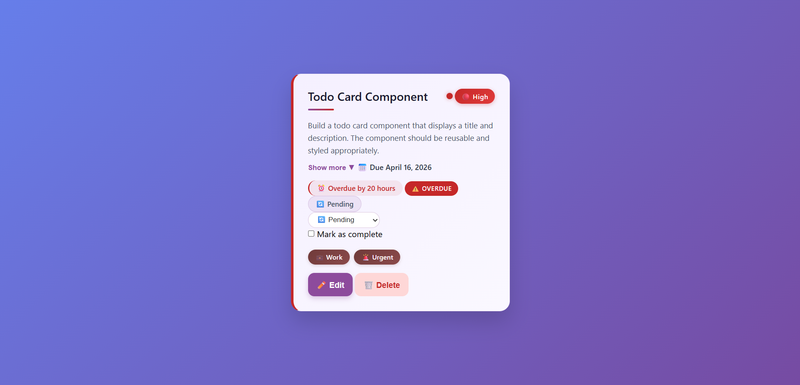

# ✅ Advanced Todo Card Component — HNG Stage 1a


## 📋 Overview

An interactive, stateful Todo Card component built for **HNG Internship Stage 1a**. This extends the Stage 0 card with full edit capabilities, status management, priority indicators, expand/collapse behavior, and enhanced time tracking.



## 🚀 Live Demo

🔗 **[View Live](https://hng-stage0-todo-card-rouge.vercel.app/)** 

---

## 🆕 What Changed from Stage 0

| Feature | Stage 0 | Stage 1a |
|---------|---------|----------|
| **Edit Mode** | ❌ Static card | ✅ Full edit form with Save/Cancel |
| **Status Management** | Checkbox only | Dropdown + Checkbox + Badge (all synced) |
| **Priority Indicator** | Text badge only | Visual dot + color-coded card states |
| **Expand/Collapse** | ❌ Not present | ✅ Toggle for extended description |
| **Time Display** | Basic days only | Granular (days/hours/minutes) |
| **Overdue Indicator** | ❌ Not present | ✅ Red badge + card border |
| **Done State** | Strike-through only | Muted colors + stops time updates |
| **State Persistence** | ❌ No state tracking | ✅ Centralized state object |

### New `data-testid` Attributes Added (13 total)
- Edit form: `test-todo-edit-form`, `test-todo-edit-title-input`, `test-todo-edit-description-input`, `test-todo-edit-priority-select`, `test-todo-edit-due-date-input`, `test-todo-save-button`, `test-todo-cancel-button`
- Status: `test-todo-status-control`
- Priority: `test-todo-priority-indicator`
- Expand/Collapse: `test-todo-expand-toggle`, `test-todo-collapsible-section`
- Overdue: `test-todo-overdue-indicator`

---

## 🎨 Design Decisions

### 1. State Management
**Decision:** Centralized `currentState` object tracking title, description, priority, dueDate, and status.

**Why:** Ensures all UI elements (badge, dropdown, checkbox, time display) stay synchronized. Makes Save/Cancel operations clean and predictable.

### 2. Priority Indicator
**Decision:** Colored dot + gradient badge + left border accent.

**Why:** Provides multiple visual cues for accessibility:
- Dot: Quick scanning
- Badge text: Screen reader support
- Border: Visible even with color blindness

**Color Mapping:**
- High: `#c52828` (Red)
- Medium: `#e9b741` (Amber/Yellow)
- Low: `#48bb78` (Green)

### 3. Status Synchronization
**Decision:** Three-way binding between status badge, dropdown, and checkbox.

**Rules Implemented:**
- Dropdown → Updates badge + checkbox
- Checkbox checked → Status = "Done"
- Checkbox unchecked → Status = "Pending"
- Status = "Done" → Time display shows "Completed" and stops updating

### 4. Time Management
**Decision:** Granular format with overdue detection.

**Display Logic:**
| Time Difference | Display |
|-----------------|---------|
| > 1 day | "Due in X days" |
| 1 day | "Due tomorrow" |
| 2-23 hours | "Due in X hours" |
| < 2 hours | "Due in X minutes" |
| Overdue | "Overdue by X hours/minutes" |
| Status = Done | "Completed" (stops updating) |

### 5. Edit Mode UX
**Decision:** Form replaces card content (not modal).

**Why:** Keeps component self-contained and mobile-friendly. Escape key closes and returns focus to Edit button.

### 6. Visual Hierarchy
**Decision:** Gradient backgrounds, soft shadows, and micro-interactions.

- Card: Subtle purple gradient for depth
- Hover: Lift effect (`translateY(-5px)`)
- Buttons: Scale on hover for tactile feedback
- Focus: High-contrast purple outline (WCAG compliant)

### 7. Mobile-First Responsive
**Decision:** Stack all sections vertically below 480px.

**Breakpoints:**
- 320px-480px: Stacked, full-width
- 481px+: Centered card, max-width 420px

---

## ⚠️ Known Limitations

| Limitation | Reason | Potential Fix |
|------------|--------|---------------|
| Edit form does not trap focus | Not required for Stage 1a | Could add focus-trap library or manual tab loop |
| Time updates every 60 seconds | Meets spec (30-60s requirement) | Could reduce to 30s for more accuracy |
| No localStorage persistence | Not in requirements | Could add `localStorage` for state preservation |
| Tags are static | Not required to be editable | Could extend edit form to include tag management |
| Delete only shows confirm dialog | Meets "dummy action" requirement | Could animate removal or add undo |
| Single card only | Stage 1a specifies single card | Stage 2+ likely adds multiple cards |

---

## ♿ Accessibility Notes

### Implemented Features
| Feature | Implementation |
|---------|----------------|
| **Labels** | All form inputs have associated `<label for="...">` |
| **ARIA Attributes** | `aria-expanded`, `aria-controls`, `aria-live`, `aria-atomic`, `aria-label` |
| **Focus Management** | Visible focus indicators on all interactive elements |
| **Keyboard Navigation** | Tab order: Checkbox → Status dropdown → Expand toggle → Edit → Delete |
| **Screen Reader Announcements** | Time updates use `aria-live="polite"` |
| **Color Contrast** | All text meets WCAG AA (4.5:1 minimum) |
| **Escape Key** | Closes edit form and returns focus to Edit button |

### Tested With
- Keyboard-only navigation (Tab, Space, Enter, Escape)
- NVDA Screen Reader (Windows)
- VoiceOver (macOS)
- Chrome Accessibility Inspector

### WCAG Compliance
- ✅ Perceivable: Color is not the only visual cue (icons + text)
- ✅ Operable: All functionality available via keyboard
- ✅ Understandable: Consistent labels and predictable behavior
- ✅ Robust: Semantic HTML with proper ARIA supplementation

---

## 📁 Project Structure
hng-stage0-todo-card/
│
├── index.html # Main HTML with view/edit modes
├── style.css # Complete styling with states
├── script.js # State management & interactivity
├── image.png # Preview screenshot
└── README.md # Documentation

---

## 🔧 Setup & Installation

1. **Clone the repository**
   ```bash
   git clone https://github.com/Kenyai402/hng-stage0-todo-card.git
   
2. Navigate to project folder

   cd hng-stage0-todo-card

3. Open in browser

  -  Double-click index.html

   - Or use Live Server in VS Code

🧪 Testing Checklist

- Edit button opens form with current values

- Save updates all card fields

- Cancel reverts and closes form

- Escape key closes edit form

- Status dropdown changes badge and checkbox

- Checkbox toggles between Pending and Done

- Priority indicator changes color (High/Medium/Low)

- Expand/collapse toggles description visibility

- Overdue indicator shows when past due date

- Time display shows granular format

- Time stops updating when status = Done

- Card shows Done state (muted, strike-through)

- Card shows Overdue state (red border)

- All data-testid attributes present

- Keyboard navigation works fully

- Mobile responsive (320px-1200px)

👤 Author : Kenyai402 — GitHub
